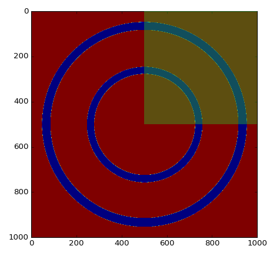
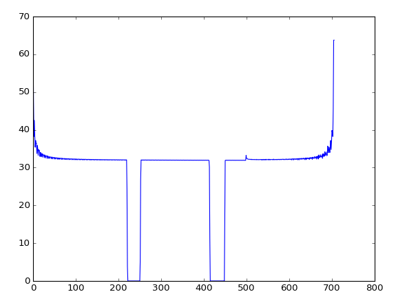

[](https://travis-ci.org/JeanBilheux/SectorizedRadialProfile)
[](https://codecov.io/gh/JeanBilheux/SectorizedRadialProfile)


# SectorizedRadialProfile
Calculate radial profile of a given angle

**Example**

```
from sectorizedradialprofile.calculate_radial_profile import CalculateRadialProfile
from PIL import Image
import matplotlib.pyplot as plt
%matplotlib notebook
```

```
data_file = 'data_2_circles.tif'
data = np.array(Image.open(data_file))
working_data = data[:,:,0]   
```

```
plt.figure(0)
plt.imshow(working_data)
```



``` 
center = {'x0': 500, 'y0': 500}  #pixels
angle_range = {'from': 0, 'to': 90}  #degrees
```

```
o_profile = CalculateRadialProfile(data=working_data, center=center, angle_range=angle_range)
o_profile.calculate()
profile = o_profile.radial_profile
```

```
plt.figure(1)
plt.plot(profile)
```




**How to run the tests**

to run test and see coverage of test
> pytest -v --cov

