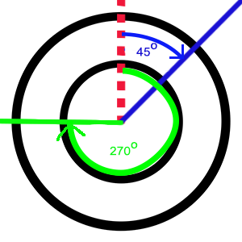

.. intro:

*************
Introduction
*************

This library allows to determine the radial profile of an image over a given angular range.

You need to specify the center of the profile and the angular range (see image 1) and then 
the program will give you the profile over that range (see image 2)

.. image:: _static/schema_of_principle.png

Image 1: pink region shows profile region we are trying to calculate

.. image:: _static/sector_profile.png

Image 2: result of profile

I would like to thank Gabriel (stackoverflow) who inspided me to come up with such a solution.

**How to define the angle**

The top vertical is angle 0 degrees. Then just go clockwise around the center of the
profile you defined. 

